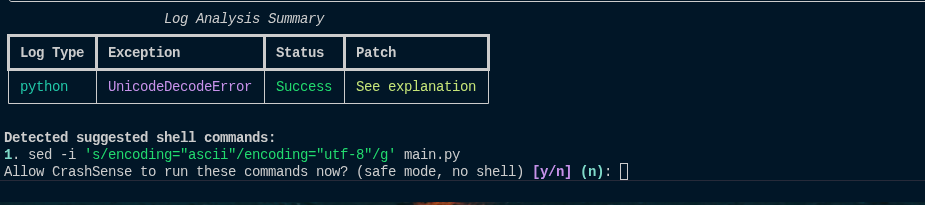

# 🚀 CrashSense

<div align="center">

**AI-Powered Crash Log Analyzer with Safe Command Suggestions**

[](https://pypi.org/project/crashsense/)
[](https://python.org)
[](LICENSE)
[](https://pypi.org/project/crashsense/)

*Quickly diagnose and remediate crash logs with AI-powered analysis*

[**🚀 Install from PyPI**](https://pypi.org/project/crashsense/) • [**📖 Documentation**](#quickstart) • [**💬 Support**](#support--donations)

</div>

---

## ✨ What is CrashSense?

CrashSense transforms the tedious process of crash log analysis into an intelligent, automated workflow. Designed for **servers**, **web infrastructure**, and **CI/CD pipelines**, it leverages AI to parse complex logs, explain root causes in plain English, and suggest actionable fixes with safe shell commands.

### 🎯 Key Use Cases

| Use Case | Description |
|----------|-------------|
| 🌐 **Web Server Analysis** | Diagnose Apache/Nginx configuration and permission issues |
| 🖥️ **System Diagnostics** | Parse kernel logs, service errors, and `/var/log` entries |
| 📋 **Incident Reporting** | Auto-generate summaries for support tickets |
| ⚡ **CI/CD Integration** | Automate crash analysis in deployment pipelines |
| 🔧 **Safe Remediation** | Get vetted shell commands with preflight safety checks |
| 🎓 **Team Education** | Learn common error patterns and best practices |

---

## 🌟 Features & Highlights

<table>
<tr>
<td width="50%">

### 🔍 **Smart Detection**
- Auto-detects latest crash logs
- Supports Python, Apache, Nginx, system logs
- Contextual analysis with terminal history

### 🛡️ **Safety First**
- Preflight command validation
- Built-in denylist protection
- Path safety verification

</td>
<td width="50%">

### 🧠 **AI-Powered**
- Concise root-cause analysis
- Actionable patch suggestions
- Optional RAG over documentation

### 🚀 **Easy Integration**
- Simple CLI interface
- Interactive TUI mode
- STDIN pipe support

</td>
</tr>
</table>

---

## 🚀 Quick Start

### Installation

```bash
# Install from PyPI
pip install crashsense

# Or install from source (development)
pip install -e .
```

### Initial Setup

```bash
# Initialize and configure LLM provider
crashsense init
```

Choose your preferred provider:
- **OpenAI GPT** (recommended for accuracy)
- **Local Ollama** (privacy-focused)

### Basic Usage

```bash
# Auto-detect and analyze latest crash log
crashsense 

# Analyze specific file
crashsense analyze /var/log/apache2/error.log

# Pipe from STDIN
tail -f /var/log/syslog | crashsense analyze

# Launch interactive TUI
crashsense tui
```

---

## 📸 Screenshots & Workflow

### 🔄 Startup & Device Detection
*CrashSense initializing and detecting compute resources*


### 🔍 Crash Log Analysis & Explanation
*AI-powered analysis showing parsed information and remediation steps*


### 📊 Summary Table & Command Suggestions
*Actionable summary with safe shell command recommendations*



---

## 📚 RAG Documentation (Optional)

CrashSense can leverage your existing documentation for more contextual analysis:

### 📁 **Default Knowledge Base**
```
kb/                              # Your custom docs
src/data/
├── crashsense_best_practices.md
├── python_exceptions_playbook.md
├── web_server_error_patterns.md
└── linux_permission_paths.md
```

### 🛠️ **Manage Documentation**

```bash
# Add custom documentation
crashsense rag add /path/to/docs/

# Clear knowledge base
crashsense rag clear

# Rebuild with dry-run preview
crashsense rag build --dry-run
```

---

## ⚙️ Configuration & Security

### 📝 Configuration File
```toml
# ~/.crashsense/config.toml
[llm]
provider = "openai"  # or "ollama"
model = "gpt-4"

[security]
safe_mode = true
confirm_commands = true
```

### 🔐 Environment Variables
```bash
export CRASHSENSE_OPENAI_KEY="your-api-key-here"
```

### 🛡️ Security Features
- ✅ Command execution requires explicit confirmation
- ✅ Built-in safety checks and validation
- ✅ Configurable security policies
- ✅ Audit trail for executed commands

---

## 🔧 Troubleshooting

### Ollama Setup Issues
```bash
# Manual model pull
ollama pull llama3.2:1b

# Check daemon status
ollama serve

# Verify installation
ollama list
```

For more help, visit the [Ollama Documentation](https://ollama.com/docs)

---

## 💝 Support & Donations

If CrashSense has helped streamline your debugging workflow, consider supporting continued development:

<div align="center">

| Platform | ID |
|----------|-----|
| 💳 **RedotPay** | `1951109247` |
| 🟡 **Binance** | `1104913076` |

*Your support helps keep CrashSense free and continuously improving!*

</div>

---

## 📄 License

This project is licensed under the MIT License - see the [LICENSE](LICENSE) file for details.

---

<div align="center">

⭐ **Star this repo** yar7am book!

</div>
